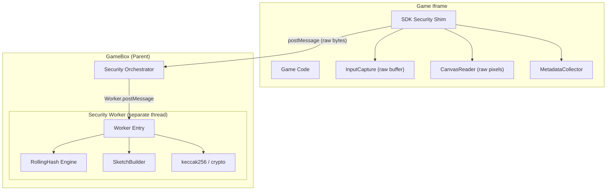

# SDK Security: Web Worker Refactor

## Problem

1. All security code runs on game's main thread (same JS context = fully bypassable)
2. Crypto/hashing disabled because it kills Android performance
3. Rolling hash, input digest, canvas hash, sketch all return `0x0`

## Solution

Split into two build artifacts from this repo:

- **SDK shim** (`main.min.4.js`) - ultra-thin, no crypto, just captures raw data
- **Security Worker** (`security-worker.min.js`) - all crypto, runs in GameBox's worker thread

## Architecture

## File Changes

### New Files (Worker)

- **[src/worker/types.ts](src/worker/types.ts)** - Worker message protocol (GameBox main thread <-> Worker thread)
- **[src/worker/crypto.ts](src/worker/crypto.ts)** - All keccak256 functions, rolling hash computation, encoding utils (moved from `security/utils.ts`)
- **[src/worker/SketchBuilder.ts](src/worker/SketchBuilder.ts)** - Moved from `security/SketchBuilder.ts` (unchanged logic, runs in worker now)
- **[src/worker/index.ts](src/worker/index.ts)** - Worker entry point: `self.onmessage` handler that processes `INIT_SESSION`, `PROCESS_CHECKPOINT`, `COMPUTE_FINAL_HASH`

### Rewritten Files (SDK Shim)

- **[src/security/SecurityBridge.ts](src/security/SecurityBridge.ts)** - Gutted to ~80 lines. No crypto imports. On `SDK_CHECKPOINT_REQUEST`: reads raw event buffer from InputCapture, reads raw pixels from CanvasReader, forwards raw bytes to parent. No hashing, no sketch, no rolling state.
- **[src/security/InputCapture.ts](src/security/InputCapture.ts)** - Simplified. Removes normalization logic. `flush()` returns raw `{t, x, y, e}` tuples as a `Float32Array` (compact, transferable). No digest computation.
- **[src/security/CanvasHandler.ts](src/security/CanvasHandler.ts)** - Renamed conceptually to "CanvasReader". Removes `keccak256Bytes` import, `sample()` returns raw `Uint8Array` pixel data (no hashing). Removes `embed()`/`extract()` (steganography moves to worker or GameBox). Keeps WebGL snapshot logic.

### Updated Files

- **[src/security/index.ts](src/security/index.ts)** - Remove `SketchBuilder` export (moved to worker). Remove `MetadataCollector` if folded into shim.
- **[src/security/utils.ts](src/security/utils.ts)** - DELETE or reduce to just `bytesToHex`/`hexToBytes` if shim needs encoding. All crypto moves to `worker/crypto.ts`.
- **[src/index.ts](src/index.ts)** - Remove `computeStateHash()` calls from `setLevelUp()` and `setPlayerFailed()`. Remove `stateHash` from progress. The shim's `computeStateHash` method is removed entirely.
- **[src/types/index.ts](src/types/index.ts)** - Simplify `CheckpointResponse` to carry raw data (events as typed array, pixels as `Uint8Array`). Remove `inputDigest`, `canvasHash`, `rollingHash`, `sketch` from SDK response (worker computes these).
- **[webpack.config.js](webpack.config.js)** - Add second entry point for worker. Produce `security-worker.min.js` with same Terser config but WITHOUT `webpack-obfuscator` domain lock (worker runs in GameBox origin, not game iframe origin).

### Deleted Files

- **[src/security/SketchBuilder.ts](src/security/SketchBuilder.ts)** - Moved to `src/worker/SketchBuilder.ts`

## Key Design Decisions

- **Raw data transfer**: SDK shim sends `Float32Array` for events and `Uint8Array` for pixels. These are [Transferable objects](https://developer.mozilla.org/en-US/docs/Web/API/Web_Workers_API/Transferable_objects) so `postMessage` uses zero-copy transfer.
- **Worker is a separate webpack entry**: produces a standalone `.js` file. GameBox can load it as `new Worker(url)` or inline it as a Blob.
- **No `@noble/hashes` in SDK bundle**: the SDK shim has zero crypto dependencies. Smaller bundle, faster load, less attack surface.
- **MetadataCollector stays in SDK**: it's 44 lines, no crypto, just reads `screen.width` etc. Stays in shim.
- **Canvas embed/extract (steganography)**: moves to worker conceptually, but actual pixel writing still requires DOM access. Will be handled via a two-step flow: worker computes watermark bytes, sends to shim via GameBox, shim writes pixels. This is a follow-up concern - checkpoint flow is priority.

